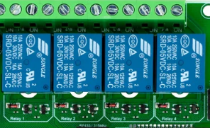

# Relays and buttons

## Relays

Relay is the physical switch and in my library
it is `class DRelay`

 

```
class DRelay: public DBase
```
The are important variabels in the class

1. Start timestamp
   
```
  unsigned long start_ms = 0;
````
2. Stop timestamp
```
    unsigned long stop_ms = 0;
```
1. Last "turn on" hour. If value is 24 this paraneter is undefined (supply dies not turn on yet). This parameter is for occasions when we need short one number turining on in an hour.  

```
 uint lschm_hour_on = 24
```


class has method `init` with parameters of supply

```
void init(int _pin, String _nStr, int _num, String _ch_onoffStr,  String _ch_ontimeStr="", String _ch_down_timeStr="")
```
Managed PIN of relay
```
      pin = _pin;
```
Name and number of relay
```
      nameStr=_nStr;
      num=_num;
```
On off MQTT channel. Result is 1 (on) or 0 (off)
```
      channel_onoff_str=_ch_onoffStr;
```
On time \ off time of relay MQTT channels. 
```
      channel_ontime_str=_ch_ontimeStr;
      channel_downtime_str=_ch_down_timeStr;
```

Any `init` should ended with

```
 init_ok=1;
```
for remember, that init was called drom Supply class.

## Methods of relay


