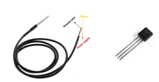
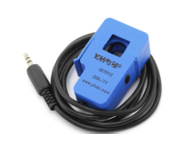
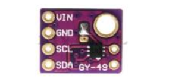
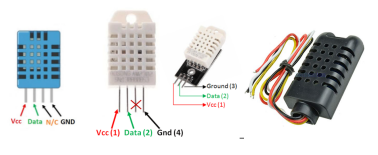
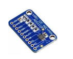

# Sensors

## Hardware Sensors Classes

:boom: Any class «Sensor» has function «GetValue» 

### DonoffSensor (abstract)

Class of Sensor with one returning value

Sensor should call method `init`

```
  void virtual init(String _name, String _chname, int _filtered, Queue<sensor_state> *_que_sensor_states, int _type, int _need_json)

```
- _name: name of sensor
- _chname: MQTT channel for sensor
- _filtered: some sensors needs filtering results (default 0)
- _need_json: publish to MQTT json results with timestamp
- _type

Types of sensors (from `donoffsettings.h`)
```
#define DONOFF_SENSOR_TYPE_TEMPERATURE 1
#define DONOFF_SENSOR_TYPE_CURRENT 2
#define DONOFF_SENSOR_TYPE_POWER 3
#define DONOFF_SENSOR_TYPE_VOLTAGE 4
#define DONOFF_SENSOR_TYPE_ENERGY 5
#define DONOFF_SENSOR_TYPE_HUMIDITY 6
#define DONOFF_SENSOR_TYPE_DHT 7
#define DONOFF_SENSOR_TYPE_TEMP 8
#define DONOFF_SENSOR_TYPE_LUX 9
#define DONOFF_SENSOR_TYPE_ADSCGANNEL 10
#define DONOFF_SENSOR_TYPE_ADS 11`
```

Global  class DEFAULT init varabels

There is default sensor vlues

No Sensor (default value befor we find sensor in device,
or when we lost sensor )
```
long  NO_SENSOR_VAL = -12700;
````

Not Ready (default value when we've found sensor, but sensor
need time to start get values)

```
long NOT_READY_VAL = -12800;
```
Some sensors need time to start send correct values
(for example mostiquere sensor, or analog current sensor),
so we need pause before sensor will send values.

```
ulong  START_DELAY = 0;
```
Some sensors need call requrest function for
start gather data (for example ds1820),
so if this const is 1, we call  `int virtual req_sensor()` 

```
  int NEED_ASKING = 0;
  int REQUEST_CIRCLE = 750;
```

Multiplier is multiply value to get long from sensor (because
various sensors return various types of data). For correct work sensor_loop() we need return long type from virtual function
```
 long virtual get_long_from_sensor()
```
If sensor returns long, MULTIPLIER=1, if it returs float MULTIPLIER=10\100 or more.

```
int MULTIPLIER = 1;
```

While we wait for sensor is ready, maybe we should do
requerest for sensor

```
    int NEED_ASK_WHILE_WATING=0;
```

To write all events to baselog MQTT channel

```
    bool NEED_BASELOG=0; 
    int  BASELOG_PERIOD=0;
```

:pint_up: Any Sensor class object must call `init` method where varables could be redefined and all additional calls
for init sensor.

Any sensor has method `long get_val()`. It should be redefined for each Sensor. This function must return `long` value. If Sensor return float (as temperature sensor), it returns long and must divide on MULIPLIER.

### Digital temperature sensor DS1821

Arduino Libraries for this Sensor

```
#include <OneWire.h>
#include <Wire.h>
#include <DallasTemperature.h>
```
 

```
class DigitalDS1820Sensor: public DSensor
```

:point_up:MQTT channels defined in Supply Class

Set init values and init sensor

```
NEED_ASKING = 1;
REQUEST_CIRCLE = 750;
debug_level=0;
MULTIPLIER = 100;

DeviceAddress tempDeviceAddress;
ds_sensor.begin();
ds_sensor.getAddress(tempDeviceAddress, 0);
ds_sensor.setWaitForConversion(false);
```

Redefine requerest function (this function is
need only for this sensor)

```
    int  req_sensor() {
      ds_sensor.requestTemperatures();
      start_request_ms = millis();
      return 1;
    };
```
Define `get_long_from_sensor` function
```
   long virtual get_long_from_sensor() {
      float raw = ds_sensor.getTempCByIndex(0);
      return long (raw * MULTIPLIER);
    };

```
Thats all for define this complicated sensor


### Analog current sensor SCT-013

Arduino Libraries
```
#include <EmonLib.h>
```



```
class SCT013Sensor: public DSensor
```
Define varables in init method. We will wait for 30sec before
sensor will publish its value. In this start perios we wiil
asking sensor. Sensor returns float with two digits, so
multiplier=100. And do start sensor from Arduino lib.

```
START_DELAY = 30000;
MULTIPLIER = 100;
NEED_ASK_WHILE_WATING=1;

emon1.current(SENSOR_PIN, 31.24);
```
:point_up: For example current is 8.25A. We returns 825.

For this sensor we need redifine only one function 
(see in souce code actual version)

```@c++
long virtual get_long_from_sensor() {
      analog_check_pre=analog_check;
      analog_check=analogRead(SENSOR_PIN); //is sensor present. if n sensor val could be 1024 (not in all versions of shield) 
      debug("SCT013", "ANALOG="+String(analog_check));
      //if ADC_MAX_VAL or near (-1), it means that sensor is absent, hard checker present
      if(analog_check>=MAX_ADC_VAL-1){  
         debug("SCT013", "No Sensor A0="+String(analog_check));
         return NO_SENSOR_VAL;
      }
      if(analog_check_pre>=MAX_ADC_VAL-1){ //olala sensor just appeared, lets wait before get vlues (START PAUSE)
        START_DELAY=start_delay_const+millis();
        return NOT_READY_VAL;
        analog_check_pre=0;
      }
      float raw = emon1.calcIrms(1480);
      //debug("SCT013", "RAW="+String(raw));
      return long (raw * MULTIPLIER);
    };
```

### Digital Light Sensor MAX4009\MAX4003

Arduino Libraries
```
#include <Wire.h>
#include <MAX44009.h>
```


```
class MAX44003Sensor: public DSensor
```
Init with 10sec delay for normalize values
```
START_DELAY = 10000;
MULTIPLIER = 1;
NEED_ASK_WHILE_WATING=0;

 Wire.begin(PIN_SDA, PIN_SCL);
      if(light.begin()){
          debug(nameStr, "Error init MAX44003 Sensor");
      }else error=0;
```
:point_up: For example light is 10000Lux. GetValue returns 10000 Lux.

Define 
```
 long virtual get_long_from_sensor() {
      return error==0 ?  (long) light.get_lux() : (long) NO_SENSOR_VAL;
    };
```
:boom: It is so simple for digital sensors with Arduino libraries !

## DMultiSensor (Abstract)

Class of Sensor with multiply sensors. Many sensors return
several values. For example, DHT11 returns Temperature and Humidity. For these sensors we need some Class with "single sensors" inside. 

In Init method of this class we start library of multisensor, get a pointer for arduino sensor and create two or more single sensors for each value. 

### Digital temperature and humidity sensor DHT11, DHT22
```
class DHTSensor: public DMultiSensor
```


Arduino Libraries
```
#include <Adafruit_Sensor.h>
#include <DHT.h>
#include <DHT_U.h>
```

Uncomment type of sensor

```
//#define DHT_TYPE    DHT11     // DHT 11
#define DHT_TYPE    DHT22     // DHT 22 (AM2302)
//#define DHT_TYPE    DHT21     // DHT 21 (AM2301)
```

MQTT channels
```
const char DHT_HUMIDITY_OUT_CHANNEL[]="/out/sensors/dht_humidity";
const char DHT_TEMP_OUT_CHANNEL[]="/out/sensors/dht_temp";
```

Init of multisensor class
1. Init DHT Arduino library and get object (m_dht) for ask values
2. Create two SingleSensor objects (for temp and humidity), and get them pointer for sensor (m_dth)

```
 void virtual init(String _name, String _chname, int _type, Queue<sensor_state> *_que_sensor_states) {

      DMultiSensor::init(_name, _chname, _type, _que_sensor_states);

      m_dht.begin(); //start phy sensor

      dht_humidity= new DHTSensorHumidity(_s, &m_dht);
      dht_humidity->init("DHT_HUMIDITY", DHT_HUMIDITY_OUT_CHANNEL, 0, _que_sensor_states, DONOFF_SENSOR_TYPE_HUMIDITY, JSON_CHANNEL_NO);

      dht_temp= new DHTSensorTemp(_s, &m_dht);
      dht_temp->init("DHT_TEMP", DHT_TEMP_OUT_CHANNEL, 0, _que_sensor_states, DONOFF_SENSOR_TYPE_TEMP, JSON_CHANNEL_NO);

        /***************/
      debug(nameStr, "MULTI DHT init ok");
 }

```

So we need define class for DHT Temperature in terms of our SingleSensor class (as for ds1820)

```
class DHTSensorTemp: public DSensor
```
Init with 10sec dealy and multiplier 100
```
NO_SENSOR_VAL = -12700;
NOT_READY_VAL = -12800;
START_DELAY = 10000;
NEED_ASKING = 0;
MULTIPLIER = 100;
```
:point_up: We dont need to init phy sensor, because we have a pointer of inited sensor in multisensor class.

We need define only function `get_long_from_sensor`

```

    long virtual get_long_from_sensor(){
      sensors_event_t event;
      pdht->temperature().getEvent(&event);
      if (isnan(event.relative_humidity)){
       debug("DHT_TEMP",String(NO_SENSOR_VAL));
       return NO_SENSOR_VAL;
      }
      float raw=event.relative_humidity;
      debug("DHT_TEMP", String(raw));
      return long (MULTIPLIER*raw);
    };
```


And we define class for Humidity
```
class DHTSensorHumidity: public DSensor
```

Init is the same as for Temp class

```
NO_SENSOR_VAL = -12700;
NOT_READY_VAL = -12800;
START_DELAY = 10000;
NEED_ASKING = 0;
MULTIPLIER = 100;
```

And `get_long_from_sensor` 

```
 long virtual get_long_from_sensor(){
      sensors_event_t event;
      pdht->humidity().getEvent(&event);
      if (isnan(event.relative_humidity)){
       debug("DHT_HUM", String(NO_SENSOR_VAL));
       return NO_SENSOR_VAL;
      }
      float raw=event.relative_humidity;
      debug("DHT_HUM", String(raw));
      return long (MULTIPLIER*raw);
    };
```

:boom: And now we have two virtual single sensors in our device ! 


### ADS1115\ADS1105 ADC Sensor

This is 4ch channel ADC, it is very popular



Arduino Libraries
```
#include <Adafruit_ADS1015.h>
```


MQTT channels
```
const char ADS_OUT_CHANNEL0[]="/out/sensors/ads0";
const char ADS_OUT_CHANNEL1[]="/out/sensors/ads1";
const char ADS_OUT_CHANNEL2[]="/out/sensors/ads2";
const char ADS_OUT_CHANNEL3[]="/out/sensors/ads3";
```

PINS are standart for SCL, SDA but might be redefined
```
#define PIN_SDA D7
#define PIN_SCL D2
```
Enable or disable channels 2,3,4 (1,2,3). First channel enabled by default
```
#define CH1 1
#define CH2 1
#define CH3 1
```

Init of multisensor class
1. Init DHT Arduino library and get object (m_dht) for ask values


```
      Wire.begin(PIN_SDA, PIN_SCL);

      ads.begin(); //start phy sensor
      debug("ADS", "ADS _BEGIN - DONE");
```

2. Create channels objects (for each channel), and get them pointer for ads

```
      adschannels[0] = new ADSSensorCH(_s,&ads, 0);
      adschannels[0]->init("ADSCHANNEL0", ADS_OUT_CHANNEL0, 0, _que_sensor_states, DONOFF_SENSOR_TYPE_ADSCGANNEL, JSON_CHANNEL_NO);

      if(CH1){
        adschannels[1] = new ADSSensorCH(_s,&ads, 1);
        adschannels[1]->init("ADSCHANNEL1", ADS_OUT_CHANNEL1, 0, _que_sensor_states, DONOFF_SENSOR_TYPE_ADSCGANNEL, JSON_CHANNEL_NO);
      }

      if(CH2){
        adschannels[2] = new ADSSensorCH(_s,&ads, 2);
        adschannels[2]->init("ADSCHANNEL2", ADS_OUT_CHANNEL2, 0, _que_sensor_states, DONOFF_SENSOR_TYPE_ADSCGANNEL, JSON_CHANNEL_NO);
      }

      if(CH3){
        adschannels[3] = new ADSSensorCH(_s,&ads, 3);
        adschannels[3]->init("ADSCHANNEL3", ADS_OUT_CHANNEL3, 0, _que_sensor_states, DONOFF_SENSOR_TYPE_ADSCGANNEL, JSON_CHANNEL_NO);
      }

```

Define class for ADSSensorCH in terms of our SingleSensor class (as for ds1820)

```
class ADSSensorCH: public DSensor
```
Init with 5 sec dealy and multiplier 1
```
      NO_SENSOR_VAL = -12700;
      NOT_READY_VAL = -12800;
      START_DELAY = 5000;
      NEED_ASKING = 0;
      MULTIPLIER = 1;
```
:point_up: We dont need to init phy sensor, because we have a pointer of inited sensor in multisensor class.

We need define only function `get_long_from_sensor`

```
 long virtual get_long_from_sensor(){
      
      long raw=pads->readADC_SingleEnded(channel);
      
      if (raw>=65535){
       debug("ADS", String(NO_SENSOR_VAL));
       return NO_SENSOR_VAL;
      } 
     
      debug("ADS"+String(channel), String(raw));
      return long (MULTIPLIER*raw);
    };
```

### Your own sensor

So, i hope you could add your sensor, it is pretty easy,
especially if there is Arduino library for sensor. You can copy one of my sensors and change `init` and `get_long_from_sensor`.